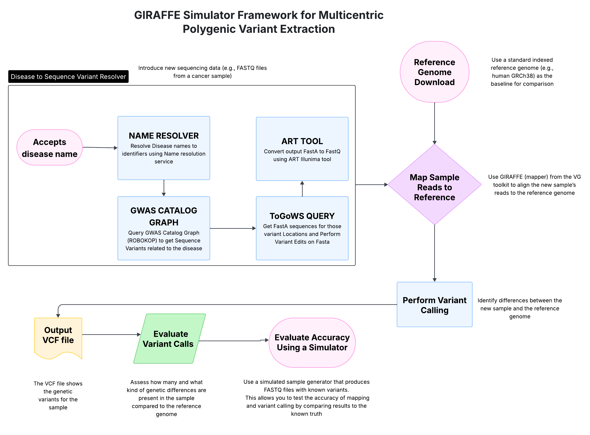

# GIRAFFE Simulator Framework for Multicentric Polygenic Variant Extraction


<div align="left">
  
</div>

## Overview
This repository provides a simulator-based benchmarking framework for evaluating the accuracy and reproducibility of polygenic variant extraction using graph-based genome references. Built on the [VG toolkit](https://github.com/vgteam/vg?tab=readme-ov-file) and leveraging the steps outlined in the [Phenome mapper](https://github.com/collaborativebioinformatics/Phenome-Mapper), this pipeline integrates simulated FASTQ data with known variants to validate variant calling performance across diverse population structures.


## How to Use It

### Prerequisites 
This repository contains scripts and resources for setting up the GIRAFFE Agent pipeline for multicentric polygenic variant extraction. It includes scripts to download reference graphs, install the VG toolkit, and prepare simulated datasets with known variants for validation.   

Ensure the following tools are installed on your system before running the setup scripts:
- `bash`
- `wget`
- `curl`
- `git`
- `python3` (≥ 3.7)
- `conda` (recommended for managing environments)
- C++ compiler with `g++` (for VG) - follow the installation steps in the [VG repo](https://github.com/vgteam/vg?tab=readme-ov-file)
- `make`, `cmake`, and other build tools (for VG installation)
- At least **100GB of free disk space** and a Unix-based environment (Linux/macOS)

Install system dependencies on Ubuntu with:

```bash
sudo apt update && sudo apt install -y build-essential cmake git wget curl unzip
```

### Installation Steps
Clone this repository
```
git clone https://github.com/collaborativebioinformatics/GiraffeAgent2.git
```

```
cd GiraffeAgent2/bootstrap-scripts
```

Run the following scripts in order to set up the environment and data

1. Download the Pangenome Reference Graph
This script fetches the pre-built population-specific pangenome. We used (JaSaPaGe) used as the backbone graph. But script download Human-pangenome files.
```
bash download-pangenome-data.sh
```

2. Install the VG toolkit and ART simulator
This script downloads and installs the VG toolkit for graph-based mapping, variant calling, and manipulation.
```
bash install_vg.sh
bash install-tools.sh
```

3. Get Sequence Variants related to a disease and Generate FASTQ
This script simulates sequencing reads by converting the sample FASTA files into FASTQ format (adds base quality scores). Required for downstream alignment. For more information please refer [here](scripts/README.md).
```
bash scripts/disease_to_variant_resolver.sh "Sickle Cell Anemia" 
```

After running the above 4 steps, you would have:
* A validated VG environment
* JaSaPaGe pangenome backbone graph
* Simulated FASTQ reads with implanted variants
* All necessary tools to begin mapping, variant calling, and evaluation

You're now ready to begin mapping and variant calling using the VG toolkit.

## Background
Traditional variant calling methods depend on linear reference genomes like GRCh38, which may not adequately represent the genetic diversity of all populations. This limitation can introduce biases in variant detection, especially in cancer genome studies that require high-resolution, polygenic analysis. To overcome these limitations, graph-based representations such as the Variation Graph (VG) allow for more accurate mapping and variant extraction. This repository integrates:
* [JaSaPaGe pangenome graph by Kulmatov et al.](https://pmc.ncbi.nlm.nih.gov/articles/PMC12343856/): A population graph built from Japanese and Saudi genomes.
* [VG GIRAFFE](https://www.science.org/doi/10.1126/science.abg8871): A fast and accurate mapper for read alignment against genome graphs.
* Synthetic data simulator: We developed a simulator to generate FASTQ files with known variants for benchmarking.

## Pipeline Summary and Workflow
1. Reference Graph Setup
* Use the JaSaPaGe graph as the backbone structure, encoding population-level variants.

2. Synthetic Sample Generation
* Simulate FASTQ files with embedded variants using the simulator.
* Variants represent realistic multicentric polygenic profiles.

3. Read Mapping
* Align synthetic reads to the JaSaPaGe graph using vg giraffe.
* Output: .gam alignment files.

4. Variant Calling
* Use the VG toolkit to perform variant calling on .gam files.
* Output: .vcf file with detected variants.

5. Evaluation
* Compare detected variants in the VCF against known ground truth variants from the simulator.
* Evaluate performance metrics: precision, recall, F1-score.

The following diagram illustrates the overall workflow followed in the GIRAFFE simulator-based validation framework:



## License

This project is licensed under the MIT License - see the LICENSE file for details.

## Support

For questions and support, create an issue on GitHub

## References

- **VG GitHub Repository**: [https://github.com/vgteam/vg](https://github.com/vgteam/vg)
- **VG Documentation**: [https://github.com/vgteam/vg/wiki](https://github.com/vgteam/vg/wiki)
- **Phenome Mapper Repository**: [https://github.com/collaborativebioinformatics/Phenome-Mapper](https://github.com/collaborativebioinformatics/Phenome-Mapper)
- **Variation Graph Toolkit Paper**: [https://www.nature.com/articles/nbt.4227](https://www.nature.com/articles/nbt.4227)
- **VG Giraffe Paper**: [https://www.science.org/doi/10.1126/science.abg8871](https://www.science.org/doi/10.1126/science.abg8871)
- [Name Resolution Service](https://name-resolution-sri.renci.org/docs#/)
- [GWAS Catalog Graph](https://robokop.renci.org/explore/graphs/gwas-catalog)
- [JaSaPaGe Paper](https://www.nature.com/articles/s41597-025-05652-y)
- [Togows API](https://togows.org/)

### Related blogs and documentation
- **NVIDIA - giraffe (vg giraffe + GATK)**: [https://docs.nvidia.com/clara/parabricks/4.4.0/documentation/tooldocs/man_giraffe.html](https://docs.nvidia.com/clara/parabricks/4.4.0/documentation/tooldocs/man_giraffe.html)
- **NVIDIA - Discover New Biological Insights with Accelerated Pangenome Alignment in NVIDIA Parabricks**: [https://developer.nvidia.com/blog/discover-new-biological-insights-with-accelerated-pangenome-alignment-in-nvidia-parabricks/](https://developer.nvidia.com/blog/discover-new-biological-insights-with-accelerated-pangenome-alignment-in-nvidia-parabricks/)


## Acknowledgements 

This project builds upon the foundational work of the VG GIRAFFE short-read mapping tool, developed by Dr. Benedict Paten's lab at the University of California, and incorporates methodologies adapted from the Phenome Mapper pipeline.
We also integrated insights and data structures from the ROBOKOP knowledge graph, and critically, from the phased genome assemblies and pangenome graphs of human populations in Japan and Saudi Arabia, published by Kulmanov, et. al (PMCID: PMC12343856 | PMID: 40796583)
We acknowledge the contributions of domain experts, the broader biomedical informatics community, and open-source developers whose tools, graphs, and research continue to drive innovation in genome analysis and pangenomics.


## Contributors

- Cheng-Han Chung (RENCI - Renaissance Computing Institute at UNC)
- Yaphet Kebede (RENCI - Renaissance Computing Institute at UNC)
- Shilpa Sundar (University of North Carolina at Chapel Hill)
- Radu Robotin (NIH/NCI)
- David Yuan (EMBL-EBI)