# GIRAFFE Agent Knowledge Graph

A comprehensive knowledge graph implementation for cancer genomics analysis using Amazon Bedrock and the GIRAFFE pipeline.

## Overview

This project implements a sophisticated knowledge graph system that integrates with Amazon Bedrock to create, analyze, and visualize relationships between cancer genome data, mutations, genes, diseases, and therapeutic compounds.

## Pipeline Overview

The GIRAFFE Agent Pipeline is a comprehensive 6-step workflow for cancer genome analysis that combines variant detection, mapping validation, and AI-powered knowledge extraction.

```mermaid
flowchart TD
    A[📚 Step 1: Reference Genome<br/>Standard indexed reference genome<br/>e.g., human GRCh38] --> B[🔬 Step 2: Input New Sample Sequences<br/>New sequencing data<br/>FASTQ files from cancer sample]
    
    B --> C[🗺️ Step 3: Map Sample Reads to Reference<br/>GIRAFFE mapper from VG toolkit<br/>Align reads to reference genome]
    
    C --> D[🧬 Step 4: Perform Variant Calling<br/>Identify genetic differences<br/>Output: VCF file with variants]
    
    D --> E[📊 Step 5: Compare Variants Against Reference<br/>Assess genetic differences<br/>Analyze mutation patterns]
    
    E --> F[✅ Step 6: Evaluate Accuracy Using Simulator<br/>Use simulated FASTQ with known variants<br/>Validate mapping and calling accuracy]
    
    F --> G[🤖 AI Knowledge Graph Integration<br/>AWS Bedrock powered analysis<br/>Entity extraction and relationship mapping]
    
    style A fill:#e1f5fe
    style B fill:#f3e5f5
    style C fill:#e8f5e9
    style D fill:#fff3e0
    style E fill:#fce4ec
    style F fill:#e0f2f1
    style G fill:#f1f8e9
```



### Pipeline Steps Detailed

#### 1️⃣ **Start with Reference Genome**
- Use a standard indexed reference genome (e.g., human GRCh38)
- Serves as the baseline for comparison
- Pre-indexed for efficient GIRAFFE mapping

#### 2️⃣ **Input New Sample Sequences**
- Introduce new sequencing data (FASTQ files from cancer samples)
- Can process both tumor and normal tissue samples
- Supports various sequencing platforms (Illumina, PacBio, ONT)

#### 3️⃣ **Map Sample Reads to Reference**
- Use **GIRAFFE mapper** from the VG toolkit
- Align new sample reads to the reference genome
- Graph-based alignment for improved accuracy
- Handles complex genomic variations

#### 4️⃣ **Perform Variant Calling**
- Identify differences between sample and reference genome
- **Output**: VCF file showing genetic variants
- Detects SNPs, indels, structural variants
- Annotates with dbSNP and clinical databases

#### 5️⃣ **Compare Detected Variants Against Reference**
- Assess number and types of genetic differences
- Categorize variants by:
  - Clinical significance (pathogenic, benign, VUS)
  - Functional impact (missense, nonsense, frameshift)
  - Population frequency
- Identify cancer-specific mutations

#### 6️⃣ **Evaluate Accuracy Using Simulator**
- Use simulated sample generator with known variants
- Produces FASTQ files with truth set
- Validates mapping and variant calling accuracy
- Quality control and benchmarking
- Continuous pipeline improvement

### Purpose of This Pipeline

🎯 **Primary Goals:**

1. **Detect Genetic Mutations** in new cancer samples
   - Identify somatic and germline variants
   - Discover novel cancer-associated mutations
   - Track clonal evolution

2. **Validate Pipeline Performance**
   - Test accuracy of mapping and variant calling
   - Benchmark against known truth sets
   - Ensure clinical-grade quality

3. **Create Training/Test Data**
   - Generate datasets with known mutations
   - Support machine learning model development
   - Enable quality control checks

4. **Build Knowledge Graphs**
   - Extract entities (genes, variants, diseases)
   - Map relationships using AWS Bedrock
   - Enable AI-powered insights and discoveries

### Workflow Integration


### Key Technologies

- **VG Toolkit**: Graph-based genome analysis
- **GIRAFFE**: Ultra-fast pangenome mapper
- **AWS Bedrock**: AI-powered entity extraction
- **Neptune**: Graph database for relationships
- **Claude 3.5**: Natural language processing
- **Titan Embeddings**: Semantic search capabilities

## Features

### 🧬 Core Knowledge Graph
- **Multi-entity support**: Genes, variants, diseases, proteins, pathways, drugs, samples, patients
- **Flexible relationships**: Multiple relationship types with properties and evidence tracking
- **NetworkX backend**: Robust graph operations and algorithms
- **Persistence**: JSON and pickle serialization support

### 🤖 Amazon Bedrock Integration
- **Claude 3 integration**: Advanced entity and relationship extraction
- **Titan Embeddings**: Vector representations for semantic search
- **Literature processing**: Extract knowledge from research abstracts
- **Clinical report analysis**: Process genomic test reports

### 📊 Advanced Visualization
- **Interactive plots**: Plotly-based web visualizations
- **Static plots**: High-quality matplotlib figures
- **Statistics dashboards**: Comprehensive graph metrics
- **Subgraph exploration**: Focus on specific entities and neighborhoods

### 🔄 Data Processing Pipeline
- **VCF/CSV/JSON support**: Multiple input formats
- **dbSNP integration**: Automated mutation annotation
- **TCGA compatibility**: Process cancer genome atlas data
- **Batch processing**: Handle large datasets efficiently

### 📤 Export Capabilities
- **Multiple formats**: Cytoscape, Gephi, CSV, JSON
- **Summary reports**: Detailed text-based analysis
- **Visualization exports**: HTML, PNG, PDF outputs

## Installation

### Prerequisites
- Python 3.8+
- AWS Account with Bedrock access
- AWS CLI configured or environment variables set

### Install Dependencies
```bash
pip install -r requirements.txt
```

### AWS Configuration
1. Copy `.env.example` to `.env`
2. Configure your AWS credentials:
```bash
export AWS_ACCESS_KEY_ID=your_access_key
export AWS_SECRET_ACCESS_KEY=your_secret_key
export AWS_REGION=us-east-1
```

## Quick Start

### 1. Basic Knowledge Graph Creation
```python
from knowledge_graph import GiraffeKnowledgeGraph, create_bedrock_client

# Initialize components
bedrock_client = create_bedrock_client()
kg = GiraffeKnowledgeGraph("My_Cancer_KG")

# Add mutation data
mutation_data = {
    'chromosome': 'chr17',
    'position': '41234470',
    'gene': 'BRCA1',
    'rsid': 'rs80357382',
    'clinical_significance': 'Pathogenic',
    'diseases': ['Breast Cancer', 'Ovarian Cancer']
}

variant_id = kg.add_mutation_data(mutation_data)
```

### 2. Literature-based Entity Extraction
```python
from knowledge_graph import GenomicsEntityExtractor

extractor = GenomicsEntityExtractor(bedrock_client)

abstract = """
BRCA1 mutations are associated with hereditary breast cancer.
PARP inhibitors target BRCA-deficient tumors effectively.
"""

entities = extractor.extract_entities_from_literature(abstract)
```

### 3. Visualization
```python
from knowledge_graph import KnowledgeGraphVisualizer

visualizer = KnowledgeGraphVisualizer(kg)

# Create interactive visualization
fig = visualizer.create_interactive_plot(
    layout='spring',
    output_file='cancer_kg.html'
)

# Create statistics dashboard
dashboard = visualizer.create_statistics_dashboard(
    output_file='kg_dashboard.html'
)
```

### 4. Complete Pipeline Example
```bash
cd examples
python complete_example.py
```

This will:
- Process sample TCGA data
- Extract entities from literature
- Create visualizations
- Export to multiple formats
- Generate summary statistics

## Project Structure

```
GiraffeAgent2/
├── knowledge_graph/
│   ├── __init__.py
│   ├── bedrock_client.py      # AWS Bedrock integration
│   ├── giraffe_kg.py          # Core knowledge graph
│   ├── mutation_processor.py  # Mutation data processing
│   ├── llm_extractor.py       # LLM-powered extraction
│   └── visualizer.py          # Visualization tools
├── examples/
│   └── complete_example.py    # Full pipeline demonstration
├── requirements.txt
├── .env.example
└── README.md
```

## GIRAFFE Pipeline Integration

This knowledge graph integrates seamlessly with the GIRAFFE pipeline:

1. **TCGA Data Processing** → Load cancer genome samples
2. **GIRAFFE Mapping** → Process alignment and variation data
3. **Mutation Identification** → Extract genomic positions
4. **dbSNP Annotation** → Enrich with clinical significance
5. **Clustering** → Group similar mutation profiles
6. **Knowledge Graph Creation** → Build relationships using Bedrock
7. **Analysis & Visualization** → Generate insights and visualizations

## Advanced Usage

### Custom Entity Types
```python
# Add custom entity types
kg.entity_types.add("biomarker")
kg.relationship_types.add("predicts_response")

kg.add_entity("biomarker_her2", "biomarker", {
    "name": "HER2",
    "type": "protein_expression",
    "clinical_utility": "therapeutic_target"
})
```

### Bedrock Model Configuration
```python
# Use different Bedrock models
bedrock_client = create_bedrock_client(region_name="us-west-2")

# Custom prompts for entity extraction
custom_entities = bedrock_client.extract_entities_and_relationships(
    mutation_data, 
    model_id="anthropic.claude-3-haiku-20240307-v1:0"
)
```

### Graph Analytics
```python
# Find shortest paths
path = kg.get_shortest_path("gene_BRCA1", "disease_breast_cancer")

# Get entity neighborhoods
neighbors = kg.get_entity_neighbors("variant_chr17_41234470_A_G")

# Graph statistics
stats = kg.get_graph_statistics()
```

## Output Files

The system generates various output files:

- **Interactive visualizations**: HTML files with Plotly graphs
- **Static plots**: High-resolution PNG/PDF images
- **Export formats**: Cytoscape JSON, Gephi GEXF, CSV tables
- **Analysis reports**: Text summaries with statistics
- **Serialized graphs**: JSON and pickle formats for persistence

## Troubleshooting

### Common Issues

1. **AWS Bedrock Access**: Ensure your AWS account has Bedrock permissions
2. **Region Availability**: Bedrock is available in specific regions (us-east-1, us-west-2)
3. **Model Access**: Request access to Claude 3 and Titan models in AWS console
4. **Memory Usage**: Large graphs may require increased memory allocation

### Testing Bedrock Connection
```bash
python examples/complete_example.py --demo-only
```

## API Reference

### Core Classes

- **`GiraffeKnowledgeGraph`**: Main knowledge graph class
- **`BedrockClient`**: AWS Bedrock integration
- **`MutationAnnotationProcessor`**: Process mutation data
- **`GenomicsEntityExtractor`**: LLM-powered entity extraction
- **`KnowledgeGraphVisualizer`**: Visualization tools

### Key Methods

- `add_mutation_data()`: Add genomic variants
- `add_sample_data()`: Add TCGA samples
- `extract_entities_from_literature()`: Process research abstracts
- `create_interactive_plot()`: Generate visualizations
- `export_to_json()`: Save graph data

## Contributing

1. Fork the repository
2. Create a feature branch
3. Make your changes
4. Add tests for new functionality
5. Submit a pull request

## License

This project is licensed under the MIT License - see the LICENSE file for details.

## Citation

If you use this knowledge graph in your research, please cite:

```
GIRAFFE Agent Knowledge Graph: Cancer Genomics Analysis with Amazon Bedrock
GitHub: https://github.com/collaborativebioinformatics/GiraffeAgent2
```

## Support

For questions and support:
- Create an issue on GitHub
- Check the troubleshooting section
- Review the example scripts
- Consult AWS Bedrock documentation

## References

### Core Technologies

#### VG Toolkit
- **VG GitHub Repository**: [https://github.com/vgteam/vg](https://github.com/vgteam/vg)
- **VG Documentation**: [https://github.com/vgteam/vg/wiki](https://github.com/vgteam/vg/wiki)
- **GIRAFFE Mapper Paper**: Hickey, G., Monlong, J., Ebler, J., Novak, A.M., Eizenga, J.M., Gao, Y., Garrett, J., Aguet, F., Ardlie, K., Benedicto, M., et al. (2023). *Pangenome graph construction from genome alignments with Minigraph-Cactus*. Nature Biotechnology.
- **VG Toolkit Paper**: Garrison, E., Sirén, J., Novak, A.M., Hickey, G., Eizenga, J.M., Dawson, E.T., Jones, W., Garg, S., Markello, C., Lin, M.F., et al. (2018). *Variation graph toolkit improves read mapping by representing genetic variation in the reference*. Nature Biotechnology, 36(9), 875-879.

#### AWS Services
- **AWS Bedrock Documentation**: [https://docs.aws.amazon.com/bedrock/](https://docs.aws.amazon.com/bedrock/)
- **Claude 3 Model Card**: [https://www.anthropic.com/claude](https://www.anthropic.com/claude)
- **Amazon Titan Embeddings**: [https://aws.amazon.com/bedrock/titan/](https://aws.amazon.com/bedrock/titan/)
- **Amazon Neptune**: [https://aws.amazon.com/neptune/](https://aws.amazon.com/neptune/)

### Cloud Infrastructure & Genomics

#### NVIDIA Clara Parabricks on AWS
- **NVIDIA Clara Parabricks AWS Tutorial**: [https://docs.nvidia.com/clara/parabricks/latest/tutorials/cloudguides/aws.html](https://docs.nvidia.com/clara/parabricks/latest/tutorials/cloudguides/aws.html)
- **NVIDIA Clara Parabricks Documentation**: [https://docs.nvidia.com/clara/parabricks/](https://docs.nvidia.com/clara/parabricks/)
- **GPU-Accelerated Genomics**: Best practices for running genomics pipelines on AWS with GPU acceleration

#### Cancer Genomics Data
- **The Cancer Genome Atlas (TCGA)**: [https://www.cancer.gov/tcga](https://www.cancer.gov/tcga)
- **TCGA Data Portal**: [https://portal.gdc.cancer.gov/](https://portal.gdc.cancer.gov/)
- **dbSNP Database**: [https://www.ncbi.nlm.nih.gov/snp/](https://www.ncbi.nlm.nih.gov/snp/)
- **ClinVar**: [https://www.ncbi.nlm.nih.gov/clinvar/](https://www.ncbi.nlm.nih.gov/clinvar/)

### Graph Analysis & Visualization

- **NetworkX Documentation**: [https://networkx.org/documentation/stable/](https://networkx.org/documentation/stable/)
- **Plotly Python**: [https://plotly.com/python/](https://plotly.com/python/)
- **Cytoscape**: [https://cytoscape.org/](https://cytoscape.org/)
- **Gephi**: [https://gephi.org/](https://gephi.org/)

### Related Research

- **Pangenome Graphs**: Eizenga, J.M., Novak, A.M., Sibbesen, J.A., Heumos, S., Ghaffaari, A., Hickey, G., Chang, X., Seaman, J.D., Rounthwaite, R., Ebler, J., et al. (2020). *Pangenome Graphs*. Annual Review of Genomics and Human Genetics, 21, 139-162.

- **Graph Genomes in Clinical Applications**: Computational Pan-Genomics Consortium. (2018). *Computational pan-genomics: status, promises and challenges*. Briefings in Bioinformatics, 19(1), 118-135.

- **Knowledge Graphs in Genomics**: Reese, J.T., Unni, D., Callahan, T.J., Cappelletti, L., Ravanmehr, V., Carbon, S., Shefchek, K.A., Good, B.M., Balhoff, J.P., Fontana, T., et al. (2021). *KG-COVID-19: a framework to produce customized knowledge graphs for COVID-19 response*. Patterns, 2(1), 100155.

### Tools & Libraries

- **Boto3 (AWS SDK)**: [https://boto3.amazonaws.com/v1/documentation/api/latest/index.html](https://boto3.amazonaws.com/v1/documentation/api/latest/index.html)
- **Pandas**: [https://pandas.pydata.org/](https://pandas.pydata.org/)
- **Matplotlib**: [https://matplotlib.org/](https://matplotlib.org/)

### Additional Resources

- **VG Community**: [VG Toolkit Gitter Chat](https://gitter.im/vgteam/vg)
- **AWS Genomics Workflows**: [https://docs.opendata.aws/genomics-workflows/](https://docs.opendata.aws/genomics-workflows/)
- **Bioinformatics Best Practices**: [GATK Best Practices](https://gatk.broadinstitute.org/hc/en-us/sections/360007226651-Best-Practices-Workflows)

---

**GIRAFFE Agent** - Multisite polygenicity extraction from cancer genomes

