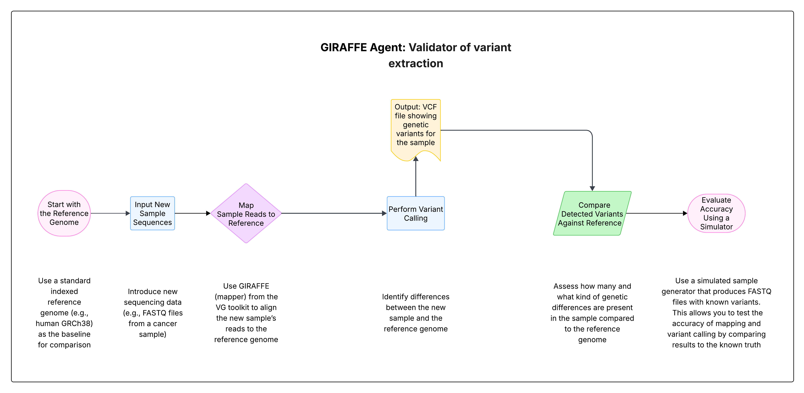

# GIRAFFE Agent Pipeline Flow Chart

## Pipeline Overview

This flowchart represents the 6-step GIRAFFE Agent Pipeline for cancer genome analysis:

1. **Start with the Reference Genome**: Use a standard indexed reference genome (e.g., human GRCh38) as the baseline for comparison.
2. **Input New Sample Sequences**: Introduce new sequencing data (e.g., FASTQ files from a cancer sample).
3. **Map Sample Reads to Reference**: Use GIRAFFE (mapper) from the VG toolkit to align the new sample’s reads to the reference genome.
4. **Perform Variant Calling**: Identify differences between the new sample and the reference genome.
➤ Output: VCF file showing genetic variants for the sample.
5. **Compare Detected Variants Against Reference**: Assess how many and what kind of genetic differences are present in the sample compared to the reference genome.
6. **Evaluate Accuracy Using a Simulator**: Use a simulated sample generator that produces FASTQ files with known variants.
This allows you to test the accuracy of mapping and variant calling by comparing results to the known truth.

## Purpose of This Flow
1. To detect genetic mutations in a new cancer sample.
2. To validate the performance of our variant calling pipeline.
3. To create training/test data using known mutations for quality checks.
