# GIRAFFE Agent Pipeline Flow Chart

```mermaid
flowchart TD
    A[🧬 Existing samples from TCGA<br/>Download cancer genome data and<br/>clinical information from TCGA] --> B[🔍 Mapping samples using GIRAFFE View tool<br/>Align genome data and detect<br/>variations across multiple sites]
    
    B --> C[📍 Identifying mutation locations<br/>Extract precise genomic positions<br/>where mutations occur in each sample]
    
    C --> D[📝 Annotating mutations using dbSNP<br/>Query dbSNP database to enrich mutations<br/>with rsID, frequency, gene info, and<br/>clinical significance]
    
    D --> E[🎯 Categorize mapped data<br/>Group similar mutation profiles using<br/>clustering techniques to find patterns]
    
    E --> F[🕸️ Create Knowledge Graph<br/>Build graph connecting cancer types<br/>with genetic variants using<br/>LLM agents GIRAFFE Agent]
    
    F --> G[🔬 Apply pipeline to new data<br/>Use complete pipeline on new/unseen<br/>cancer genome samples for rapid<br/>annotation and insight generation]
    
    style A fill:#e1f5fe
    style B fill:#f3e5f5
    style C fill:#e8f5e8
    style D fill:#fff3e0
    style E fill:#fce4ec
    style F fill:#e0f2f1
    style G fill:#f1f8e9
```

## Pipeline Overview

This flowchart represents the 7-step GIRAFFE Agent Pipeline for cancer genome analysis:

1. **Data Acquisition**: Starting with existing TCGA samples
2. **Genome Mapping**: Using GIRAFFE View for alignment and variation detection
3. **Mutation Identification**: Extracting precise genomic positions
4. **Annotation**: Enriching mutations with dbSNP database information
5. **Categorization**: Clustering similar mutation profiles
6. **Knowledge Graph Creation**: Building relationships using GIRAFFE Agent
7. **Pipeline Application**: Deploying on new cancer genome data

The pipeline flows sequentially from data acquisition to final application, with each step building upon the previous one to create a comprehensive cancer genome analysis system.