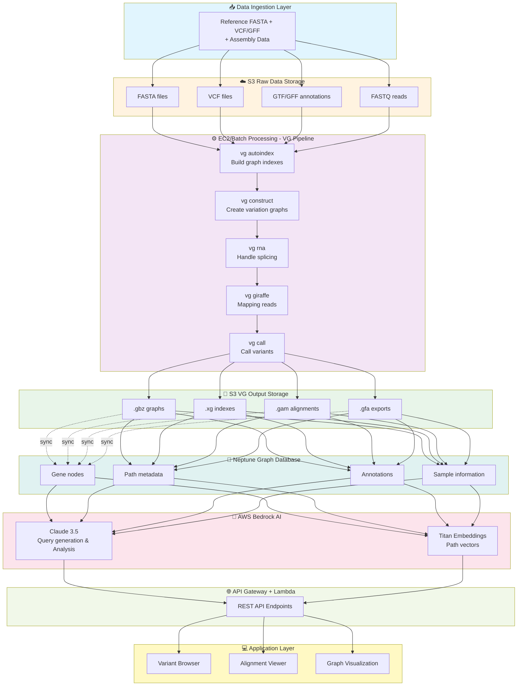
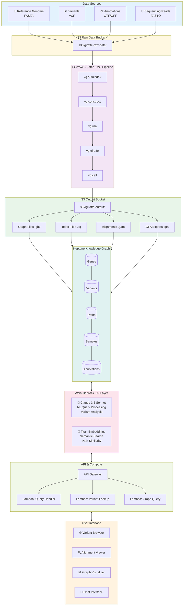
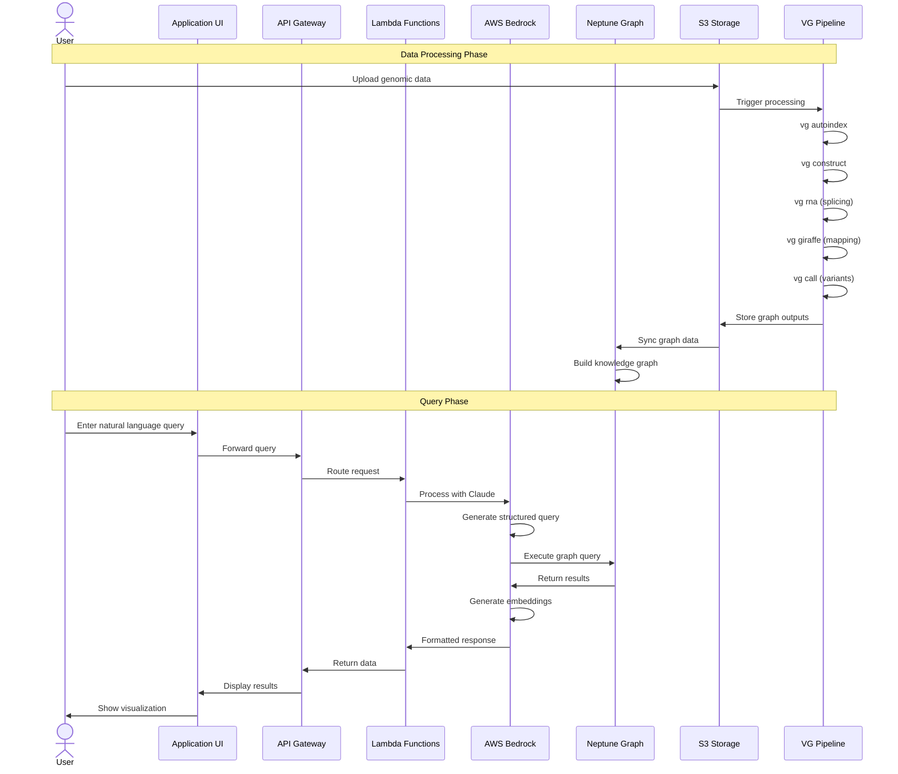
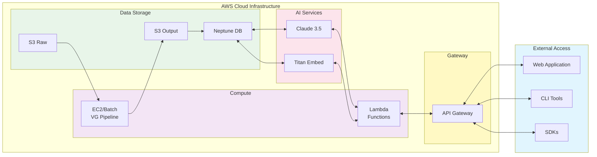
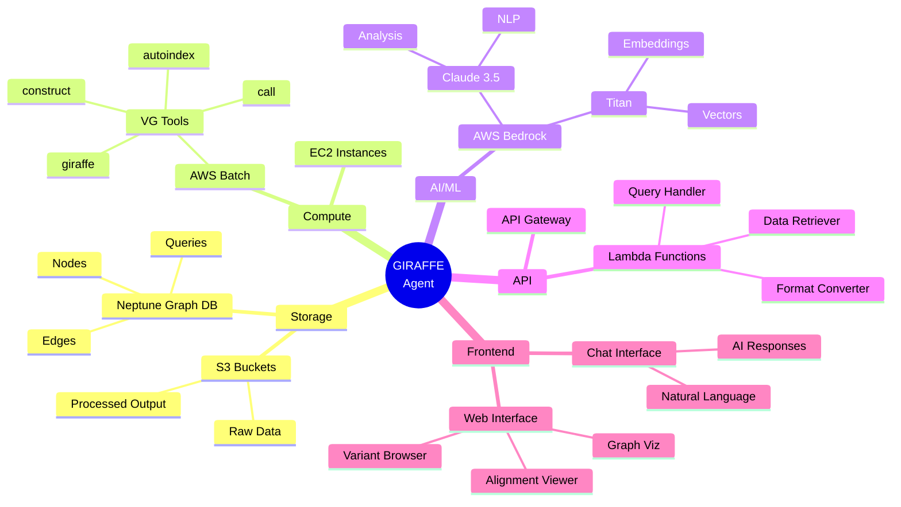

# GIRAFFE Agent AWS Architecture - Visual Flow

## Complete Pipeline Flow Chart

## Detailed Architecture Diagram

## Sequential Processing Flow

## Component Interaction Diagram

## Data Flow by Stage

```mermaid
flowchart LR
    subgraph Stage1["Stage 1: Ingestion"]
        A1[Raw Genomic Data]
    end
    
    subgraph Stage2["Stage 2: Graph Construction"]
        B1[VG Build]
        B2[Index Creation]
    end
    
    subgraph Stage3["Stage 3: Mapping"]
        C1[Read Alignment]
        C2[Variant Calling]
    end
    
    subgraph Stage4["Stage 4: Knowledge Graph"]
        D1[Graph Population]
        D2[Relationship Building]
    end
    
    subgraph Stage5["Stage 5: AI Enhancement"]
        E1[Embedding Generation]
        E2[Semantic Indexing]
    end
    
    subgraph Stage6["Stage 6: Query & Analysis"]
        F1[User Queries]
        F2[AI-Powered Insights]
    end
    
    A1 ==> B1
    B1 ==> B2
    B2 ==> C1
    C1 ==> C2
    C2 ==> D1
    D1 ==> D2
    D2 ==> E1
    E1 ==> E2
    E2 ==> F1
    F1 ==> F2
    
    style Stage1 fill:#e3f2fd
    style Stage2 fill:#f3e5f5
    style Stage3 fill:#e8f5e9
    style Stage4 fill:#e0f2f1
    style Stage5 fill:#fce4ec
    style Stage6 fill:#fff9c4
```

## Technology Stack Overview

---

## Key Features Illustrated

### 🔄 **Bidirectional Sync**
S3 Output ↔ Neptune Graph ensures data consistency

### 🤖 **AI Integration**
Claude 3.5 processes natural language queries and generates insights

### 📊 **Multi-Format Support**
`.gbz`, `.xg`, `.gam`, `.gfa` - comprehensive VG output handling

### 🔍 **Semantic Search**
Titan Embeddings enable intelligent path and variant discovery

### 🌐 **REST API**
Standard API Gateway + Lambda for scalable access

### 💻 **Rich UI**
Multiple specialized viewers for different data types

---

*All diagrams are rendered using Mermaid syntax and can be viewed in GitHub, VS Code, or any Mermaid-compatible viewer.*
